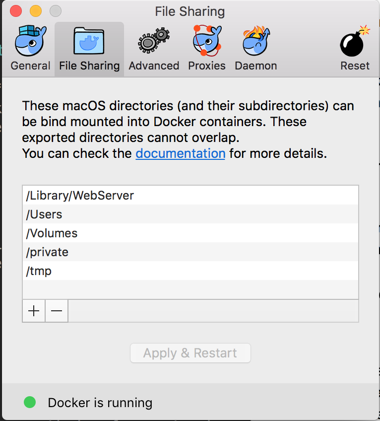
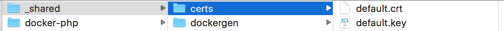
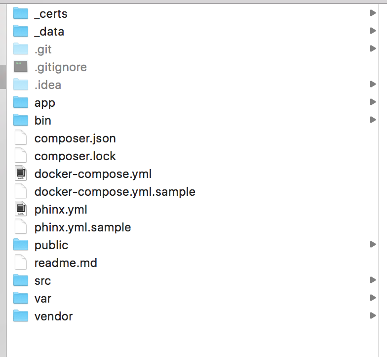

# Docker als Entwicklungsumgebung am Mac

## Problem und Ziel

Mamp / Lamp Entwicklugnsumgebung war nicht mehr flexibel genug. Gerade bei der Entwicklung mit verschiedenen PHP Versionen kam es immer wieder zu Problemen

**Ziel:** flexible lokale Entwicklungsumgebung, die je nach Projekt dessen technische Anforderungen erfüllt

## Anforderungen

- **Microservice Architectur** soll möglich sein 
- **einfaches "hochfahren"**: Entwicklungsumgebungen sollten schnell verfügbar sein
- **vhosts** "dev.website.de" muss auch weiterhin funktionieren (Lizenzen etc.)
- **SSL-Zertifikate** müssen funktionieren. Z.B. für Entwicklung und Tests von Payment Schnittstellen
- **schnelle Einrichtung**: die Einrichtung neuer Projekte muss schnell gehen
- **Performance**: Ladezeiten müssen im Rahmen bleiben
- **dev = stage = live**: Die Entwicklungsumgebung soll mit der gleichen Struktur laufen, wie auch die Liveumgebung

## Umsetzung

### Microservice Architektur

**Docker** ist darauf ausgelegt, die verschiedenen Komponenten einer Applikation in einzelnen Containern auszuführen. Eine Kommunikation zwischen den Containern ist einfach möglich.

### einfaches hochfahren

**Docker Compose** ist eine Konfigurationsdatei für Docker Container. Über die Kommandozeile können so alle Container mit Hilfe eines Befehls `docker-compose up -d` gestartet werden.

### vhosts

Lösung: [https://github.com/jwilder/nginx-proxy](https://github.com/jwilder/nginx-proxy)

- Proxy, der als Container gestartet wird (Auch einfach über `docker-compose up -d`)
- dieser leitet Einträge aus der Hosts Datei an entsprechende Container weiter
- die dev URL muss in der docker-compose Datei des Projektes eingetragen werden

### schnelle Einrichtung

Die Einrichtung eines neuen Projektes beinhaltet folgende Schritte:

1. **docker-compose Datei** ins Projekt kopieren und Konfigurationen vornehmen
2. dev url in **hosts Datei** eintragen: `sudo nano /etc/hosts` eintragen
3. **SSL Zertifikat** für lokale URL erstellen `sudo openssl req -x509 -nodes -days 365 -newkey rsa:2048 -keyout dev.url.de.key -out dev.url.de.crt`
4. Alle **Container hochfahren** mit Hilfe von `docker-compose up -d`
5. Falls **Datenbank** nötig ist: Datenbank entweder über PhpMyAdmin oder über die Konsole anlegen

### einfaches hochfahren

Per Konsole in das Verzeichis wechseln, dann: `docker-compose up -d`

### SSL-Zertifikate

Lösung: [https://github.com/jwilder/nginx-proxy](https://github.com/jwilder/nginx-proxy)

Hier müssen drei Elemente zusammen spielen:

- der proxy muss das Zertifikats-Verzeichnis kennen
- der Applikations-Container muss das Zertifikats-Verzeichnis kennen
- die Apache Configs des Applikations-Containers müssen die Verzeichnisse kennen

#### Wie funktioniert das Einbinden der SSL Zertifikate

Dafür muss es im System einen Ordner mit den Zertifikaten geben. Auf diesen Ordner müssen sowohl der Proxy als auch die "Applikation" zugreifen. Hierfür muss der Ordner in beiden als Volume eingebunden werden.

### Performance

Na ja ...

Das Problem ist hier die Einbindung der Volumes. Die Syncronisation der Daten in die Container dauert zu lange. Hier wird aber gerade viel getan. Hoffnung: Bald wird es besser ...


## Technische Grundlagen

### Proxy Einrichtung


### Installation von Docker

Installation von Docker for Mac: https://docs.docker.com/docker-for-mac/ und Freigabe der entsprechenden Entwicklungsverzeichnisse. 



### Virtual Hosts im Applikations-Container

```
klotzaufklotz:
  image: rotd/docker-shopware-php56-ioncube-phpmyadmin-proxy:latest
  container_name: klotzaufklotz
  links:
     - klotzaufklotzdb
  environment:
   - VIRTUAL_HOST=local.klotzaufklotz.de
   # phpmyadmin password
   - PHPMYADMIN_PW=shopware
   # DB Values
   - DB_USER=shopware
   - DB_PASSWORD=shopware
   - DB_DATABASE=shopware
   - DB_PORT=3306
   - DB_HOST=klotzaufklotzdb
  volumes:
   - ./:/var/www/html
  expose:
   - "80"
```

### SSL Zertifikate

#### Docker-Compse Datei des Proxy Containers

```
version: '2'
services:
  nginx:
    image: nginx
    container_name: nginx
    ports:
      - 80:80
      - 443:443
    volumes:
      - /etc/nginx/conf.d
      - /Library/WebServer/Documents/_docker/_shared/certs:/etc/nginx/certs
    network_mode: bridge
    #environment:
    #  - VIRTUAL_PORT=443
    #expose:
    # - "80"
    # - "443"

  dockergen:
    image: jwilder/docker-gen
    command: -notify-sighup nginx -watch /etc/docker-gen/templates/nginx.tmpl /etc/nginx/conf.d/default.conf
    volumes_from:
      - nginx
    volumes:
      - /var/run/docker.sock:/tmp/docker.sock:ro
      - /Library/WebServer/Documents/_docker/_shared/dockergen/nginx.tmpl:/etc/docker-gen/templates/nginx.tmpl
    network_mode: bridge
```

#### Docker-Compse Datei des Applikations-Containers

```
base:
  image: rotd/docker-base-php7-proxy:latest
  container_name: base
  environment:
   - VIRTUAL_HOST=test.dev

   # phpmyadmin password
   - PHPMYADMIN_PW=base
   - ROOT_DIR=_site/
   # DB Values
   - DB_USER=base
   - DB_PASSWORD=base
   - DB_DATABASE=base
   - DB_PORT=3306
   - DB_HOST=127.0.0.1
  volumes:
   - /Library/WebServer/Documents/_docker/_shared/certs:/etc/apache2/ssl
   - ./:/var/www/html
  expose:
   - "80"
```

#### Apache Config des Applikations-Containers

Dafür müsen dann auch in den Apache-Configs entsprechend die Zertifikate eingebunden werden:

```
<Virtualhost *:443>
        ServerAdmin webmaster@localhost
        ErrorLog ${APACHE_LOG_DIR}/error.log
        CustomLog ${APACHE_LOG_DIR}/access.log combined
        SSLEngine On
        SSLCertificateFile /etc/apache2/ssl/${VIRTUAL_HOST}.crt
        SSLCertificateKeyFile /etc/apache2/ssl/${VIRTUAL_HOST}.key
        DocumentRoot /var/www/html/${ROOT_DIR}
        <Directory /var/www/html/${ROOT_DIR}>
                AllowOverride All
                Require all granted
        </Directory>
</Virtualhost>
```

### Ordnerstruktur

#### Bestandteil 1: "Infrastruktur":



- _docker/docker-proxy-ssl/: starten des Proxys als Container
- _docker/shared/dockergen/: nginx.tmpl file. Wird benötigt für den Proxy. Speicherung der aktuel generierten Einstellungen für die Weiterleitungen zu den Containern. Pfad muss entsprechend in der docker-compose Datei unter `docker/docker-proxy-ssl/docker-compose.yml` eingetragen werden.
- _docker/_shared/certs/: Zertifkate. Können über `sudo openssl req -x509 -nodes -days 365 -newkey rsa:2048 -keyout dev.url.de.key -out dev.url.de.crt` erstellt werden

#### Bestandteil 2: Im Projekt:



- docker-compose.yml file im Root
- _data Verzeichnis. Hier werdem die Daten aus dem MySql Container gespeichert